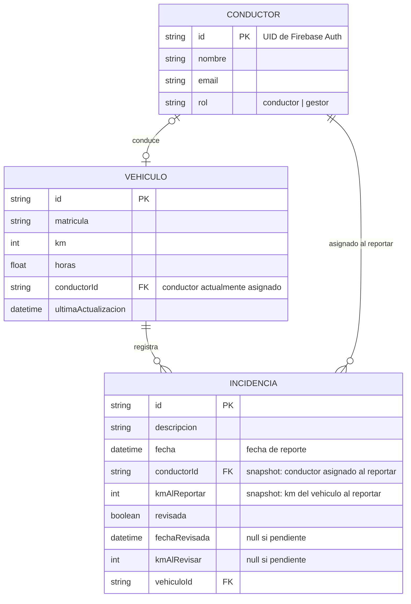

# Modelo de datos

Modelo de dominio de GarageBase: entidades, atributos y relaciones. Es independiente de la tecnología de persistencia — el mapa concreto a Firestore (colecciones, sub-colecciones, denormalizaciones) se documenta en [`firestore-schema.md`](firestore-schema.md).

## Diagrama ER

## Entidades

**Conductor.** Persona que conduce un vehículo. El campo `rol` distingue entre conductor normal y `gestor` (modelado como flag, no como entidad aparte). El `id` coincide con el UID de Firebase Auth — autenticación e identidad de dominio comparten la misma clave.

**Vehiculo.** Unidad de la flota. Mantiene `km` y `horas` acumulados junto con la fecha de `ultimaActualizacion` (el conductor actualiza los viernes). `conductorId` apunta al conductor actualmente asignado.

**Incidencia.** Aviso registrado sobre un vehículo. Almacena dos snapshots del momento del reporte (`conductorId`, `kmAlReportar`) y dos del momento de revisión (`fechaRevisada`, `kmAlRevisar`). Los snapshots son inmutables: si el vehículo se reasigna o el conductor cambia de nombre, el registro histórico permanece intacto.

## Relaciones

**`Conductor ⟷ Vehiculo` (0..1 en ambos lados).** Un conductor conduce como mucho un vehículo en cada momento; un vehículo tiene como mucho un conductor asignado. El "cero" en ambos lados permite conductores sin vehículo todavía y vehículos en proceso de reasignación.

**`Vehiculo → Incidencia` (1 a 0..muchos).** Cada incidencia pertenece a exactamente un vehículo. Un vehículo puede tener cero incidencias o muchas.

**`Conductor → Incidencia` (1 a 0..muchos) — snapshot.** El `conductorId` en la incidencia no es una FK "viva" sino un snapshot histórico del conductor asignado al vehículo en el momento del reporte. Si el vehículo se reasigna más adelante, la incidencia sigue reflejando quién lo conducía cuando se creó.

## Invariantes del dominio

- Existe exactamente un `Conductor` con `rol = gestor`.
- `km` y `horas` son monotonamente crecientes entre actualizaciones sucesivas — nunca disminuyen.
- Una `Incidencia` marcada como `revisada` no vuelve a estado pendiente.
- Solo el `gestor` puede modificar el campo `revisada`.
- Solo el conductor actualmente asignado a un vehículo puede actualizar `km`, `horas` o añadir incidencias.
- Al crear una incidencia, `conductorId` y `kmAlReportar` se fijan con el estado actual del vehículo y no se modifican después.
- Al marcar `revisada = true`, se fijan `fechaRevisada` y `kmAlRevisar` con el estado actual del vehículo y no se modifican después.
- La actualización de `km` y `horas` se confirma explícitamente por el usuario antes de enviarse (protección contra modificaciones accidentales, especialmente del gestor que no tiene acceso físico al vehículo).

## Decisiones deliberadamente NO modeladas

- **Histórico de asignaciones conductor↔vehículo.** El modelo refleja el estado presente. Para auditar reasignaciones se añadiría `Asignacion(conductorId, vehiculoId, desde, hasta)`.
- **Múltiples gestores.** El campo `rol` ya soportaría varios sin cambios de estructura.
- **Auditoría de revisiones** (qué gestor revisó). Redundante con un único gestor.