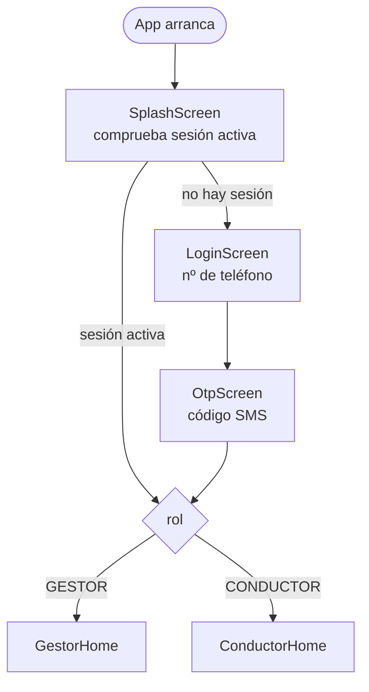
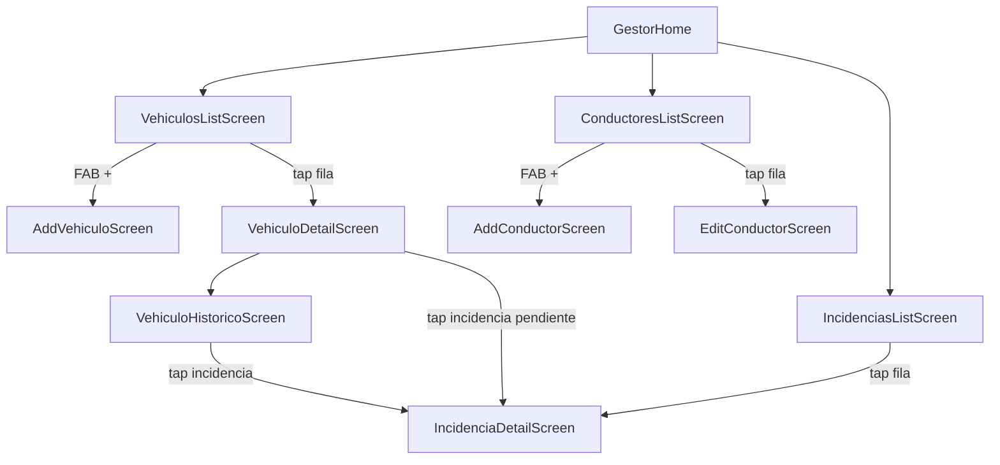
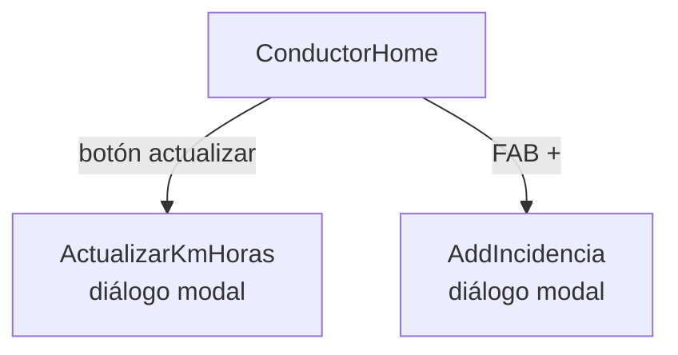

# Mapa de pantallas — GarageBase

Referencia de producto: qué pantallas existen, qué muestran y cómo se conectan.
Actualizar cuando se añada o cambie una pantalla.

---

## Flujo de autenticación (ambos roles)

### LoginScreen
- Campo: número de teléfono (formato E.164)
- Botón: "Enviar código"

### OtpScreen
- Campo: código de 6 dígitos recibido por SMS
- Botón: "Verificar"
- Enlace: "Reenviar código"

---

## Grafo del Gestor

### GestorHome
Pantalla de inicio del gestor. Tres accesos directos (cards o botones grandes):
- **Vehículos** → VehiculosListScreen
- **Conductores** → ConductoresListScreen
- **Incidencias** → IncidenciasListScreen

---

### ConductoresListScreen
- Tabla de dos columnas: **Conductor** | **Matrícula asignada** (o "—" si no tiene)
- FAB `+` → AddConductorScreen
- Tap en una fila → EditConductorScreen

### AddConductorScreen
Campos:
- Nombre completo
- Número de teléfono (E.164)
- Vehículo asignado — selector desplegable con los vehículos ya registrados (muestra matrícula)

Acción: botón "Guardar" → diálogo de confirmación con resumen de datos → guarda y vuelve a ConductoresListScreen

### EditConductorScreen
Mismos campos que AddConductorScreen, prerellenos con los datos actuales.
Acción: botón "Guardar cambios" → diálogo de confirmación con resumen de datos → guarda y vuelve a ConductoresListScreen

---

### VehiculosListScreen
- Lista: **Matrícula** | **Conductor asignado** (o "—")
- FAB `+` → AddVehiculoScreen
- Tap en una fila → VehiculoDetailScreen

### AddVehiculoScreen
Campos:
- Matrícula

Acción: botón "Añadir" → guarda y vuelve a VehiculosListScreen

### VehiculoDetailScreen
Secciones:
1. **Datos actuales**: matrícula, km, horas, fecha de última actualización, conductor asignado
2. **Asignar conductor**: selector desplegable con los conductores registrados — permite reasignar desde aquí
3. **Incidencias pendientes**: lista de incidencias sin revisar con botón "Marcar revisada" en cada una
4. **Botón "Histórico"** → VehiculoHistoricoScreen

### VehiculoHistoricoScreen
- Lista completa de incidencias del vehículo (pendientes + revisadas), ordenadas por fecha descendente
- Tap en incidencia → IncidenciaDetailScreen

---

### IncidenciasListScreen
Lista global de incidencias pendientes de toda la flota.
Columnas: **Matrícula** | **Fecha**
- Tap en una fila → IncidenciaDetailScreen

### IncidenciaDetailScreen
Muestra:
- Matrícula del vehículo
- Conductor que la reportó y su nombre
- Fecha del reporte
- Km al reportar
- Descripción completa

Si la incidencia está **pendiente**: botón "Marcar como revisada" → diálogo de confirmación (acción irreversible)
Si ya está **revisada**: fecha de revisión + km al revisar (solo lectura)

---

## Grafo del Conductor

### ConductorHome
- Ficha del vehículo asignado: matrícula, km actuales, horas actuales, última actualización
- Lista de incidencias propias con su estado (pendiente / revisada)
- Botón "Actualizar km y horas" → diálogo ActualizarKmHoras
- FAB `+` → diálogo AddIncidencia

### ActualizarKmHoras (diálogo modal)
Campos:
- Nuevos km (validación: debe ser ≥ km actuales)
- Nuevas horas (validación: debe ser ≥ horas actuales)

Acción: botón "Confirmar" → diálogo de confirmación con los nuevos valores → guarda

### AddIncidencia (diálogo modal)
Campos:
- Descripción (texto libre)

Acción: botón "Reportar" → guarda la incidencia con snapshot automático (conductorId, conductorNombre, kmAlReportar, fecha)
